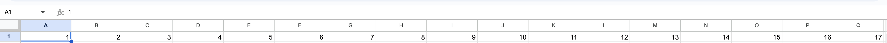

# Excel Sheet Row and Columns Sequence Number

This time, we're going to assign a number to each row and column found within our Excel file in a sequential order.

## How does it work ?

As we all know, each sheet in the excel file can be represented in a pair of row and column. For instance, A1 to represent the first row and first column, B1 to represent the first row and second column, C1 for the first row and and third column, and so on.
As mentioned earlier, our primary task will be to assigning a number for each row and column in a sequential order. Therefore, '1' should be assigned to A1, '2' should be assigned to B1, '3' should be assigned to C1, and so on. See the image below for clarity.
Please note that for simplicity, we will apply a constraint to our column so it won't be greater than 'Z'. Therefore 'Z' will be the last column in our sheet (there will be no AA, AB, etc).

## Run the Sample

`npx ts-node index.ts`
