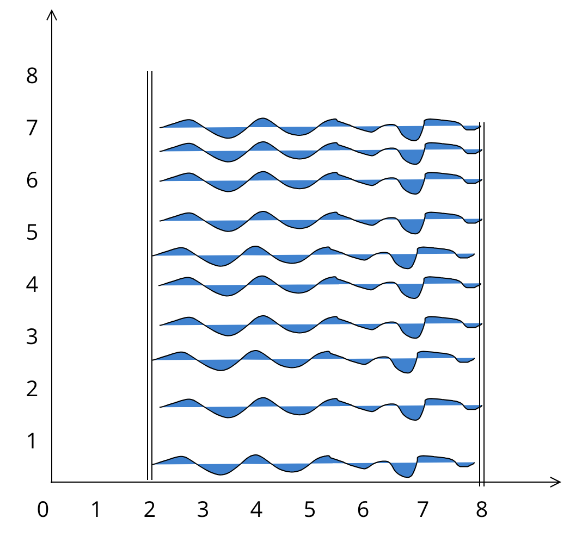

# Max Contained Water

The main purpose of this sample is to demonstrate how to find a pair of number from the given array of numbers that can be combined together to produce a bucket with the most contained water.

## How does it work ?

TLDR; given an array of these numbers: [1, 8, 6, 2, 5, 4, 8, 3, 7], you can draw an XY diagram such as follow:

```
  Y
  /\
  |
  |
8 |       ()                        ()
  |
7 |                                           ()
  |
6 |            ()
  |
5 |                       ()
  |
4 |                            ()
  |
3 |                                      ()
  |
2 |                  ()
  |
1 |   ()
  |
  - - - - - - - - - - - - - - - - - - - - - - - - - - - > X
      0    1    2    3    4    5    6    7    8
                        indices
```

From the depicted diagram, visually speaking we can say that the pair of '8' (index 1) and '7' (index 8) will produce a bucket with the most contained water.
See the picture below for clarity:



To prove it, we can calculate the volume using the formula: `width x height x height` where each `height` represent the respective number within the array that is paired together, and `width` represent the interval (distance) between the first pairing number to the second pairing number (**index-based calculation**).
See all possible permutations as shown in the following table below (take a note that only sensible combinations were shown here):

| 1st Pairing Number | Second Pairing Number | width | volume |
| :----------------: | :-------------------: | :---: | :----: |
|   `1` (index 0)    |     `7` (index 8)     |  `8`  |  `56`  |
|   `8` (index 1)    |     `8` (index 6)     |  `5`  | `320`  |
|   `8` (index 1)    |     `7` (index 8)     |  `7`  | `392`  |

## Run the Sample

`npx ts-node index.ts`
